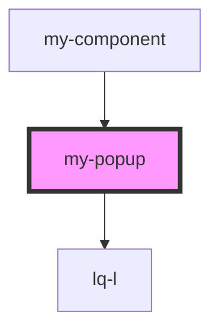

# stencil-headerbar

<!-- Auto Generated Below -->

## Properties

| Property  | Attribute | Description | Type                            | Default     |
| --------- | --------- | ----------- | ------------------------------- | ----------- |
| `setting` | --        |             | `{ textbox?: TextboxSetting; }` | `undefined` |

## Dependencies

### Used by

 - [my-component](.)

### Depends on

- [lq-l](.)

### Graph

----------------------------------------------

*Built with [StencilJS](https://stenciljs.com/)*
