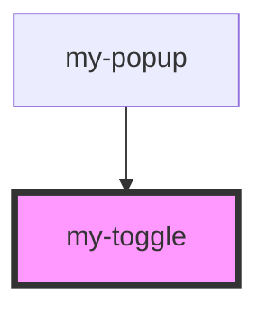

# stencil-headerbar

<!-- Auto Generated Below -->

## Properties

| Property  | Attribute | Description | Type                 | Default     |
| --------- | --------- | ----------- | -------------------- | ----------- |
| `textbox` | --        |             | `{ label: string; }` | `undefined` |

## Dependencies

### Used by

 - [my-popup](.)

### Graph

----------------------------------------------

*Built with [StencilJS](https://stenciljs.com/)*
